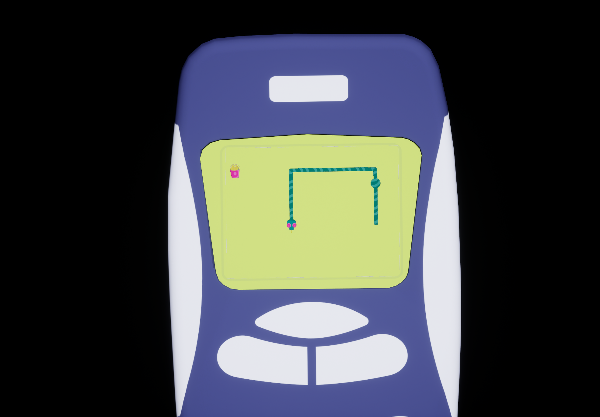

# Snake Game in Unreal Engine 5.5

This is a classic Snake game built entirely with Unreal Engine widgets and displayed directly in the game world. Move the snake using WASD keys to collect food, grow longer, and avoid crashing into yourself. The game leverages Unreal's UMG (UI system) for rendering the game as widgets while placing them in a 3D environment.

## Features
- **WASD Controls**: Simple keyboard controls to move the snake.
- **Widget-Based Gameplay**: The snake and grid are created using Unreal's Widget Blueprint system.
- **3D World Display**: Game is rendered as part of the 3D world, giving a unique twist to the classic Snake.

## Getting Started
Clone the repository, open the project in Unreal Engine, and hit play! The snake's ready to start munching.
